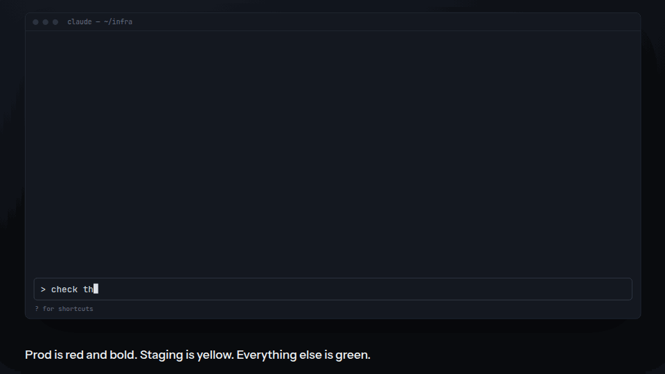

# env-badge

See at a glance which environment a Claude Code Bash command hits. env-badge draws a small badge under each Bash tool row:

```
⏺ Bash(kubectl get pods --context prod-eu)
  ⚠ k8s: prod-eu

⏺ Bash(aws s3 ls)
  aws: sandbox (default)
```

Prod shows up red and bold. Staging is yellow. Everything else is green.



The badge is only there to catch your eye. It doesn't block commands, change their output, or add anything to Claude's context.

> **Warning: no badge doesn't mean safe.** The command parser is simple. It misses subshells, `bash -c`, heredocs, and commands inside scripts. Don't use the badge, or a missing badge, to decide whether a command is allowed. Use permissions for that.

## Install

In Claude Code:

```
/plugin marketplace add aqaurius6666/claude-env-badge
/plugin install env-badge@env-badge
```

env-badge uses function hooks, so start Claude Code with them turned on:

```sh
CLAUDE_CODE_ENABLE_FUNCTION_HOOKS=1 claude
```

**Claude Desktop (and other GUI launches):** the app doesn't read your shell's environment, so a variable exported in `~/.zshrc` never reaches it. Set it in the `env` block of `~/.claude/settings.json` instead, then restart the app:

```json
{
  "env": {
    "CLAUDE_CODE_ENABLE_FUNCTION_HOOKS": "1"
  }
}
```

This works for the terminal too.

It works as soon as it's installed: AWS and Kubernetes are covered out of the box.

## What you get by default

| Tool | Triggers on | Target comes from | When the command doesn't name one |
|---|---|---|---|
| AWS | `aws` | `--profile x`, `AWS_PROFILE=x` | `$AWS_PROFILE` |
| Kubernetes | `kubectl`, `helm`, `k9s` | `--context x`, `--kube-context x` | `kubectl config current-context` |

| Name contains (case-insensitive) | Badge |
|---|---|
| `prod` or `prd` | **⚠ red, bold** |
| `stg` or `stag` | yellow |
| anything else | green |

**What the markers mean:**
- `(default)`: the command named no target, so the badge shows your current one, such as the active kube context.
- `…`: still looking up the current target.
- `?`: the lookup failed. This badge is dim and uncolored on purpose, so an unknown target never looks safe.

Each row keeps the target it was first drawn with. After `kubectl config use-context`, older rows still show the context they actually ran against, and the next row probes the new one.

## Configure

Add options to any `settings.json` (user, project or local) under `pluginConfigs.env-badge.options`, then run `/env-badge reload`.

> **Keep every value flat.** Values must be strings, numbers, booleans or string lists. Nested objects are ignored. That's why each field gets its own dotted key, like `"prod.match"`.

### Recipes

**Treat more names as prod:**

```json
"prod.match": "prod|prd|live"
```

**Add Terraform:**

```json
"rules": ["aws", "k8s", "tf"],
"tf.bins": ["terraform"],
"tf.vars": ["TF_WORKSPACE"],
"tf.default": ["terraform", "workspace", "show"]
```

Setting `rules` replaces the built-in list, so keep `aws` and `k8s` in it if you still want them.

**Show friendly names instead of raw ids** (for example, AWS account ids to aliases):

```json
"aws.label": ["~/bin/aws-alias"]
```

See [Label scripts](#label-scripts).

**Turn it off:** `"enabled": false`.

Full example:

```json
{
  "pluginConfigs": {
    "env-badge": {
      "options": {
        "rules": ["aws", "k8s", "tf"],
        "tf.bins": ["terraform"],
        "tf.vars": ["TF_WORKSPACE"],
        "tf.default": ["terraform", "workspace", "show"],
        "aws.label": ["~/bin/aws-alias"],
        "prod.match": "prod|prd|live"
      }
    }
  }
}
```

## Commands

| Command | Use it to |
|---|---|
| `/env-badge test <cmd>` | Preview the badge for a command, e.g. `/env-badge test kubectl get pods`. |
| `/env-badge doctor` | See the effective config and caches. It also lists option keys nothing reads, which is how typos show up. |
| `/env-badge reload` | Apply settings edits, clear caches, and redraw. |

## Troubleshooting

- **No badge at all.** Check that Claude Code was started with `CLAUDE_CODE_ENABLE_FUNCTION_HOOKS=1`. On Desktop, set it in `~/.claude/settings.json` `env` (see [Install](#install)), since the app ignores your shell profile. Then run `/env-badge test <your command>`. If it says `no rule matches`, the command's first word isn't in any rule's `bins`.
- **Settings change did nothing.** Run `/env-badge reload`. Then check `/env-badge doctor` for unknown keys, which usually mean a typo, or for a nested object, which gets ignored.
- **Badge stuck on `?`.** The `default` command failed. Run it yourself in a shell. For AWS, `?` usually means `AWS_PROFILE` isn't set.
- **Resumed session shows the wrong target on old rows.** Row pins only live in memory, so after a resume old rows show the *current* target.
- **Badge in the terminal but not on Desktop.** Run a matching command (e.g. `kubectl get pods`) on Desktop, then `/env-badge doctor`. If `/env-badge` is unknown, the plugin didn't load there (function hooks off, see above). If `Bash rows seen` has no `desktop=` entry, Desktop never asked the plugin to draw that row. If it shows `desktop=N (badged M)` with M > 0, the badge was handed to Desktop but Desktop didn't draw it.
- **Desktop shows `?` where the terminal shows a name.** A GUI launch gets a minimal `PATH` and none of your shell's variables, so `kubectl` (e.g. in `/opt/homebrew/bin`) isn't found and `AWS_PROFILE` is unset. Add what's missing to the same `env` block, e.g. `"PATH": "/opt/homebrew/bin:/usr/bin:/bin"` and `"AWS_PROFILE": "sandbox"`, or use absolute paths in `default`/`label`.
- **VS Code or mobile shows `?` or raw names.** Only the terminal is verified live.

## Reference

### How a badge is built

1. **Match.** The command is split on `&&`, `||`, `;`, `|` and newlines. The first word of each part is checked against each rule's `bins`. A path prefix is ignored, so `/usr/bin/aws` matches `aws`.
2. **Named target.** The target comes from a flag (`--profile x`, `--profile=x`), a `VAR=x cmd` prefix, or an earlier `export VAR=x`.
3. **Session default.** If nothing is named, the rule's `default` command runs to find the current target.
4. **Label (optional).** A `label` script can turn the raw name into a friendlier one.
5. **Tier.** The shown name is matched against the tiers in order. The first match sets the color, bold and prefix.

### Top-level options

| Key | Default | Meaning |
|---|---|---|
| `enabled` | `true` | Turn the badge on or off. |
| `tools` | `["Bash"]` | Tools that get a badge. |
| `rules` | `["aws", "k8s"]` | Rule ids, in order. Replaces the built-in list. |
| `tiers` | `["prod", "stg", "other"]` | Tier ids, checked in order. Replaces the built-in list. |
| `format` | `{prefix}{id}: {name}{default}` | Badge text. Placeholders: `{prefix}`, `{id}`, `{name}`, `{raw}`, `{tier}`, `{default}`. |
| `labelTimeoutMs` | `2000` | Timeout for `default` and `label` scripts. |
| `labelTtlMs` | `300000` | How long a label result is cached. |
| `defaultTtlMs` | `10000` | How long a session default is cached. Every finished call of a `tools` tool also drops it, so the next row probes again. |

### Rule options: `<rule>.<field>`

| Field | Meaning |
|---|---|
| `bins` | Command names that trigger the rule. |
| `flags` | Flags that name the target. |
| `vars` | Env vars that name the target. |
| `default` | Command (argv, no shell) that prints the current target. |
| `label` | Command (argv, no shell) for a label script. |

In `default` and `label`, an argument starting with `~/` expands to your home directory.

### Tier options: `<tier>.<field>`

| Field | Meaning |
|---|---|
| `match` | Regex, case-insensitive. |
| `color` | Text color, e.g. `red`, `yellow`, `cyan`. |
| `bold` | `true` or `false`. |
| `prefix` | Text before the badge, e.g. `"⚠ "`. |

Settings are merged from every source: user < project < local < flag < policy. The last one wins per key.

### Label scripts

The script gets JSON on stdin:

```json
{"kind": "aws", "name": "123456789012", "isDefault": false, "tierHint": "other", "command": "aws s3 ls --profile 123456789012"}
```

It prints either plain text (the first non-empty line is used) or JSON:

```json
{"text": "billing-prod", "tier": "prod", "color": "red", "bold": true, "prefix": "⚠ "}
```

- Only `text` is required. `tier` forces a tier by id, and the other fields override that tier's style.
- Output is cleaned up: first line only, ANSI and control characters stripped, 60 characters max.
- A non-zero exit, a timeout or empty output falls back to the raw name. Failures are cached too, so a broken script doesn't rerun on every redraw.

[`examples/aws-label.sh`](examples/aws-label.sh) maps account-id profiles to names. It has no exec bit, so run it through `sh`:

```json
"aws.label": ["sh", "~/path/to/claude-env-badge/examples/aws-label.sh"]
```

## Development

```sh
/plugin-types             # in Claude Code: writes API types to .claude/types
bun test .spec.ts         # unit specs; the filter keeps bun off register.test.tsx
claude plugin test        # hook tests in the plugin test kit
claude plugin validate    # checks the hook and API footprint
```

Live run from the repo:

```sh
CLAUDE_CODE_ENABLE_FUNCTION_HOOKS=1 claude --plugin-dir . --settings '{"pluginConfigs":{"env-badge":{"options":{"aws.label":["sh","'"$PWD"'/examples/aws-label.sh"]}}}}'
```

The script path uses `$PWD` because label scripts aren't guaranteed to run from the repo directory.

The demo GIF comes from [`demo/index.html`](demo/index.html). Edit the scenes there, then run `npm i --no-save playwright gifenc pngjs && node demo/record.mjs` (JetBrains Mono and Instrument Sans must be installed locally).

Commits follow [Conventional Commits](https://www.conventionalcommits.org) (`<type>(<scope>)?!?: <subject>`), checked on every PR. Merging to `main` bumps `plugin.json` and tags `vX.Y.Z` from them: `feat!:`/`BREAKING CHANGE` → major, `feat:` → minor, `fix:`/`perf:`/`refactor:` → patch; `docs`, `test`, `chore`, `ci`, `build`, `style` don't bump.

Why settings are read by hand: the engine only passes a plugin the keys `plugin.json` declares (`enabled`), so env-badge reads `pluginConfigs` from each settings source itself.
